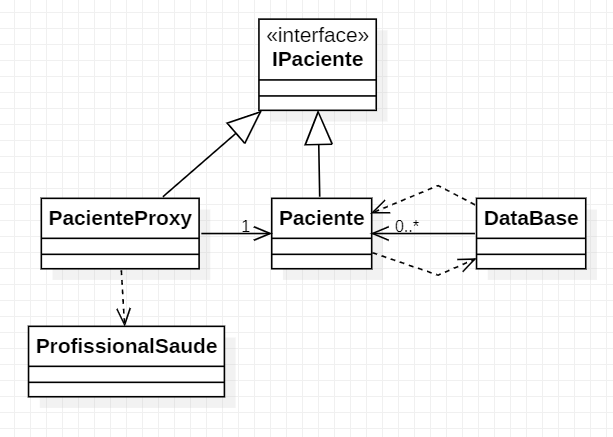

# Padrão Proxy

Objetivo: econimizar recurso.  
Carrega objetos sob demanada.

- Proxy Dados: Dados carregam a medida que são necessários.
- Proxy de Segurança: dados não carregam por falta de acesso

**Caso de Uso**: Acesso aos dados de pacientes em um hospital.

